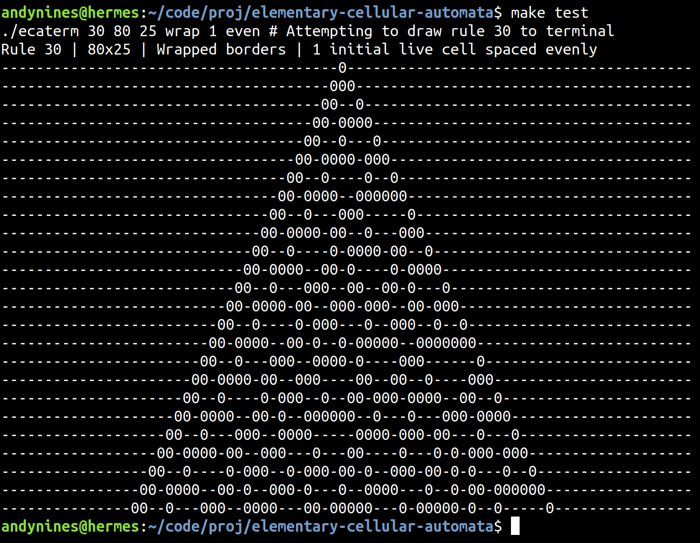
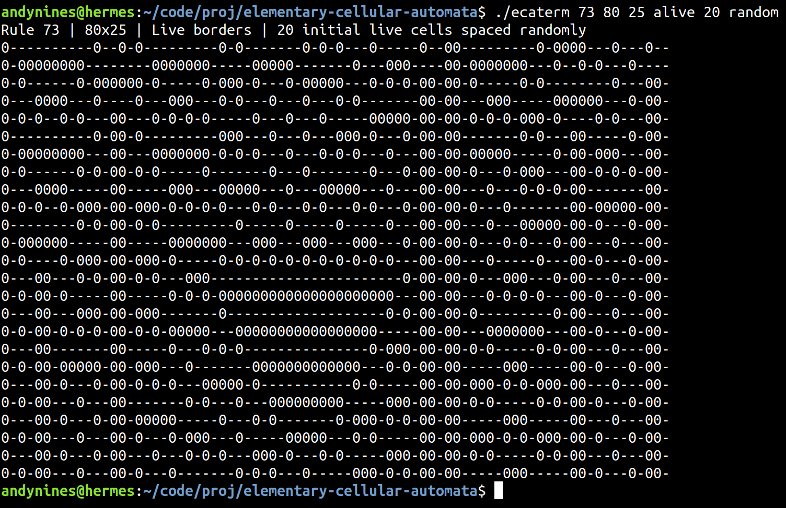
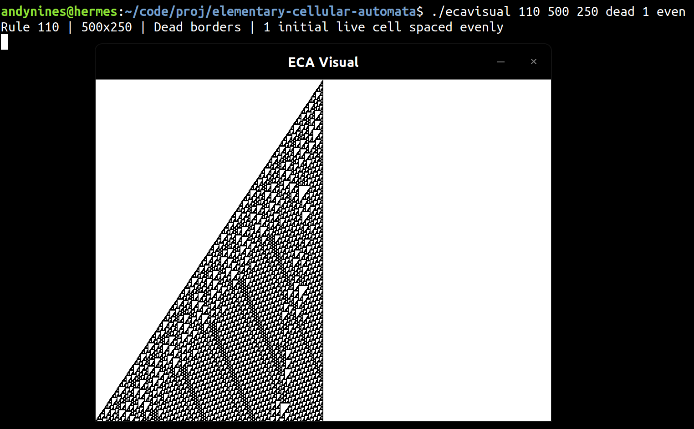
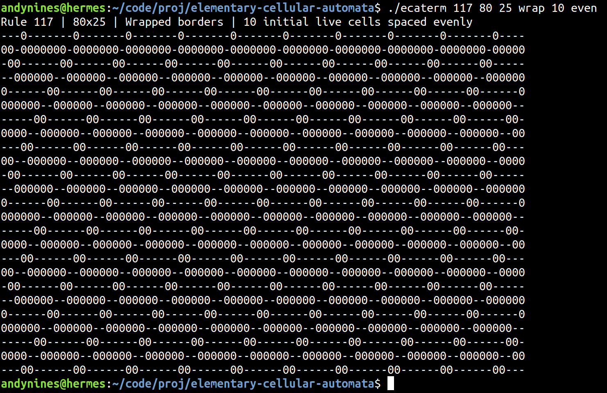
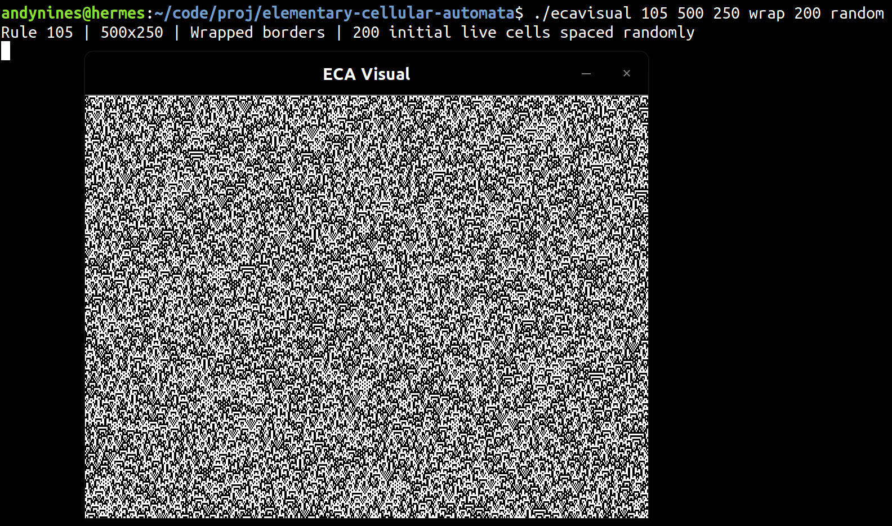

# Elementary Cellular Automata

This project simulates and creates visual representations of the elementary cellular automata. Read more about these cellular automata on [Wikipedia](https://en.wikipedia.org/wiki/Elementary_cellular_automaton "Go to Wikipedia.com").


## License

The contents of this repository are made available under the [MIT License](../license.txt "Go to full license text").


## Dependencies

The `ecavisual` application requires SDL2. All other dependencies are part of the C standard library.


## Compilation

Use the included `Makefile` to build the two applications.
+ `make`: Build both applications.
+ `make ecaterm`, `make ecavisual`: Build specific application.
+ `make test`: Do a test run with `ecaterm`. A successful test looks like this:

+ `make clean`: Remove all object files created during the compilation process.
+ `make purge`: Deconstruct the project; remove all object files and executable files.


## Usage

### Argument format

Pass arguments to either executable from the command line. Call one of them without arguments to see this usage message:
```
Usage: ./exec-name rule habitat-width buffer-height boundary-type cells-alive spacing

rule:              integer from 0 to 255
habitat-width:     integer greater than 0
buffer-height:     integer greater than 1
boundary-type:     wrap, dead, alive
cells-alive:       integer from 0 to habitat-width
spacing:           even, random
```
+ **Rule**: A number in the range from 0 to 255 in Wolfram's numbering scheme. Determines the state of a cell during the next time step based on the states of itself and its two immediate neighbors.
+ **Habitat width**: The number of cell spaces available in a single generation.
+ **Buffer height**: The maximum number of generations stored in memory at a given time.
+ **Boundary type**: Determines how the leftmost and rightmost cells in a generation react to their left and right neighbors, respectively. For instance, when this option is set to "dead," the leftmost cell will behave as if there is a dead cell to its left. If instead set to "wrap," the leftmost and rightmost cells will see each other as neighbors. Note that at the first instant during which a wrap occurs, the design:
    1. Becomes periodic. *(However this may not be obvious if the period is long.)*
    2. Is no longer a representation of what the design would look like if it was being simulated in an infinitely wide space.
+ **Cells alive**: The number of cells in the initial generation that will be alive.
+ **Spacing**: How the alive cells of the initial generation are spaced. If set to even, the alive cells will have an even distance between them and be centered as much as possible. This option works best when *cells alive* and *habitat width* create a reduceable ratio. If set to "random," the spacing will instead be chaotic.

Use the spacebar to iterate an `ecavisual` simulation.

**Warning**: `ecavisual` simulations take up a lot of memory! Avoid creating larger simulations (like the ones seen in "examples") unless you know that your machine can handle it.

### Examples










## Documentation

The following is a brief documentation of the public methods in each of this repository's libraries, even though literally no one is ever going to use any of them.

### eca.h

Space-efficient elementary cellular automaton simulation library.

**createSim()**
```c
Simulation* createSim(int rule, int habitatSize, int genBufferSize, BoundaryCode borderType, ConfigCode initCode)
```
Given a rule from Wolfram's numbering scheme, a number of cells belonging to a 
single generation, a number of generations to store on memory, a method of
interpreting the neighborhoods of edge cells, and a code specifying how the
initial generation should be populated, build a simulation according to these
attributes and return a pointer to it.

**getCellState()**
```c
bool getCellState(CellBlock* intlBlockPtr, int cellIndex)
```
Locate a particular cell bit based off of a pointer to its generation's memory
block and its index relative to that entire generation. Return a boolean
representing the cell's state; live cells return true and dead cells return
false.

**iterateSim()**
```c
void iterateSim(Simulation* simPtr, int iterations)
```
Knowing the latest states of each cell in a simulation, calculate their next
state. Place the resulting new generation in the buffer, deleting the oldest
generation in the buffer if necassary in order to make room.
   
**destroySim()**
```c
void destroySim(Simulation* simPtr)
```
Remove a simulation's data from memory using its pointer.

### ecaio.h

Methods for reading in arguments that specify different attributes of a simulation, and outputting text representations of simulations in the terminal.

**createUserSim()**
```c
Simulation* createUserSim(int argc, char* argv[])
```
This method wraps the createSim method in eca.c, reading in an argument vector and extracting its information in order to create a simulation specified by a user on the command line. If all arguments are acceptable, it passes back the pointer received from the sim creator. Otherwise, it displays a usage message and returns a null simulation pointer.

**infoStr()**
```c
void infoStr(Simulation* simPtr)
```
Uses the information from a simulation pointer to print a formatted string containing relevant information about that simulation.

**genOut()**
```c
void genOut(Simulation* simPtr, int genIndex)
```
Reads the data contained in a simulation at the specified index in the generation buffer. Prints a line of text, each character of which represents a live or dead cell according to the OutChar enum in ecaio.h.

**simOut()**
```c
void simOut(Simulation* simPtr)
```
Wraps the genOut method in order to print every generation in the buffer of a given simulation, printing the oldest buffer line first.

### allocs.h

Wrappers for standard memory allocation functions that check for allocation failures.

**safeMalloc()**
```c
void* safeMalloc(size_t size)
```
Receive a number of bytes, and attempt to allocate a memory block of that size. Return a pointer to the new block of memory so long as the allocation succeeds. Program exits upon failure.

**safeRealloc()**
```c
void* safeRealloc(void* memBlockPtr, size_t size)
```
Receive a pointer to a block of memory and a number of bytes. Attempt to resize the memory block to the specified size and return a pointer to the resized block of memory if allocation succeeds. Program exits upon failure.

### fracs.h

Methods for working with structures meant to represent mathematical fractions.

**createFrac()**
```c
Fraction* createFrac(int num, int denom)
```
Given a numerator and denominator, allocate the space to store these ints in a fraction "object" for further calculations. Return a pointer to the new structure.

**simplifyFrac()**
```c
void simplifyFrac(Fraction* fracPtr)
```
Given a pointer to a fraction structure, reduce its numerator and denominator down to their simplest form.

**destroyFrac()**
```c
void destroyFrac(Fraction* fracPtr)
```
Wrap the standard deallocation method for completeness. Free the fraction
structure pointed to by the argument.

### utils.h

Miscellaneous mathematical methods used in the elementary cellular automata simulation engine.

**binomProb()**
```c
bool binomProb(double p)
```
Given some double representing the probability of success of a two-outcome event, return a boolean representing the success of this event during a single trial. True means success; false means failure.

**min()**
```c
int min(int a, int b)
```
Given two integer arguments, return back the smaller of those two values.

**wrap()**
```c
bool wrap(int* n, int nMax)
```
Given a pointer to an integer and a maximum value for this number, test to see if this number is within the inclusive range between 0 and the specified maximum. If it is outside this range, wrap the number back into it using modulo and return true. Otherwise, return false.


## Todo

+ `ecavisual` is currently a hulking mess in terms of its code and memory consumption. Look into ways to improve this.
+ Organize the source code into folders and spiffy up the Makefile.
